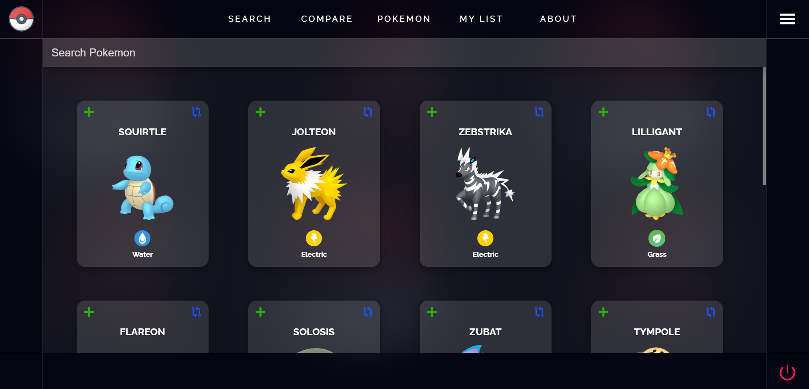
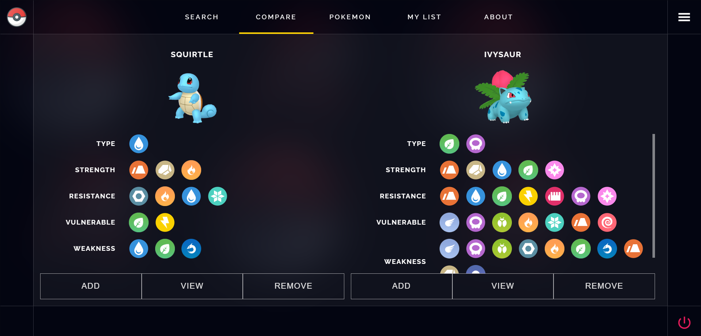

# Pokédex 📲

The **Pokédex (ポケモン 図鑑 ずかん , Pokemon Zukan, Illustrated Pokémon Encyclopedia)** is an electronic device created and designed to catalog and provide information regarding the various species of Pokémon featured in the Pokémon video game, anime and manga series.

#### Technology Used ✨
   

#### Screenshots 📸

